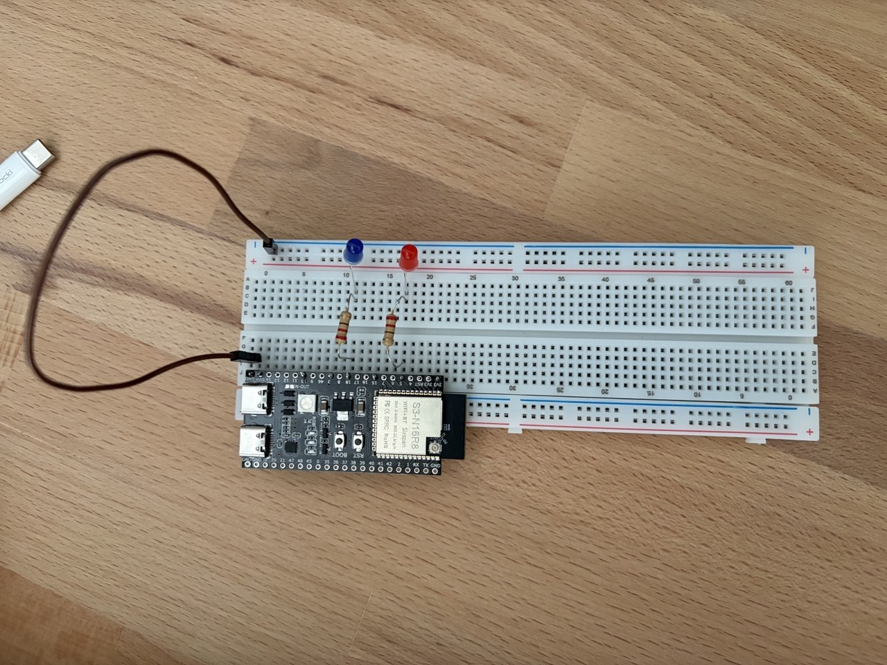
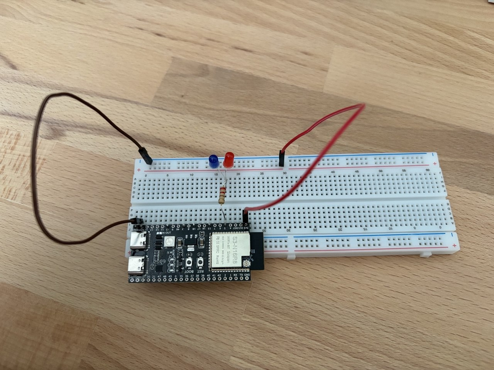

# HW 1.3

Blinking blue and red leds.

- **v1**: 2 leds are controlled from 2 pins, blinking with varying frequency.
- **v2**: 2 leds are controlled from single pin, by switching the direciton of current. Blinking at constant frequency.

## Photos

| v1 | v2 |
| --- | --- |
|  |  |

## Demo v1

https://github.com/user-attachments/assets/5cd1e4f4-d7f9-4841-9db9-e69c7f60ed7d

## Demo v2

https://github.com/user-attachments/assets/d5ceab3f-7a11-433b-964d-97bfef9d2603

