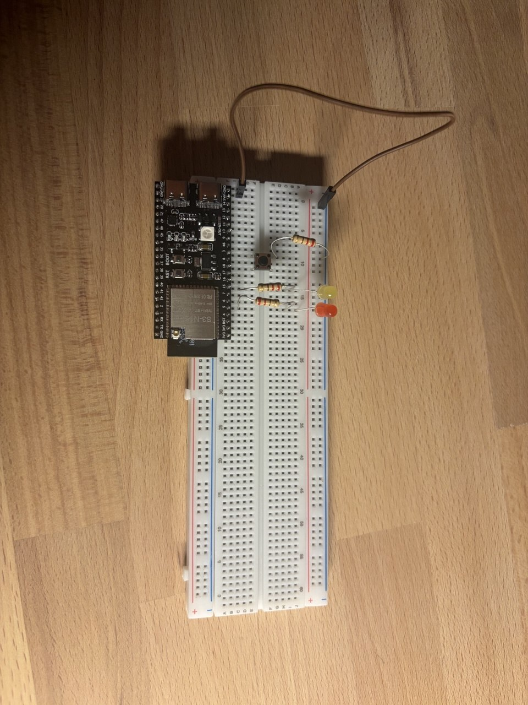

# HW 1.4

Blinking red and yellow led with switching modes. The requirement is for the blinking to be done with `delay`.

- **v1**: the external button sets low frequency (1s per LED), the boot button sets high frequency (50ms per LED).

## Photos

