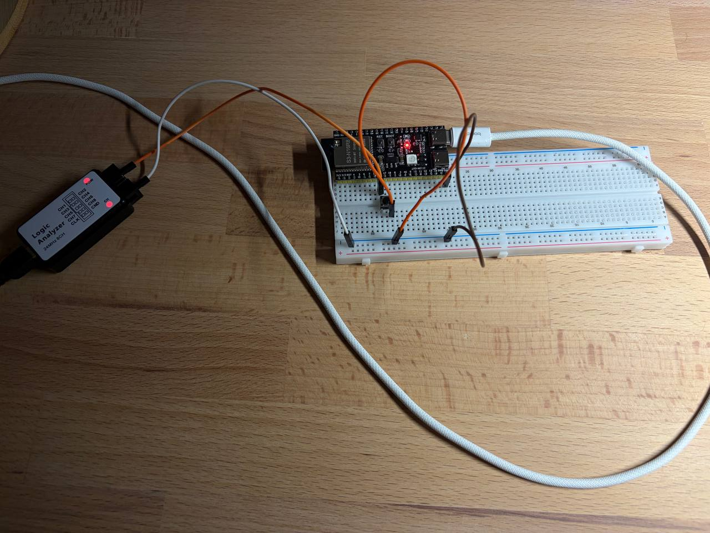

# Homework 1.5 - Buttons, logic analyzer and interupts

The number of bounces/falling edges were counted with esp32 interrupt (see src/main) and with logic analyzer. The output of the logic analyzer than is processed with a script.

## Setup



## Data from the logic analyzer

```
Sample rate:             4 MHz (timestep = 0.000250 ms/sample)
Capture length:          11467.008 ms
Bounce threshold:        30 ms
Total raw edges:         48
  raw falling edges:     24
Total glitches:          28
Total glitch sequences:  3
Total bounces:           14
Total presses:           10
Shortest press:          333.7140 ms  (start = 2379.8828 ms)
Longest press:           429.5750 ms  (start = 8961.0262 ms)
Shortest glitch:         0.0003 ms  (start = 7347.7967 ms, HIGH)
Longest glitch:          0.2717 ms  (start = 7347.5250 ms, LOW)
```

## Data from the c++ code

```
Button Pressed! Count: 1
Button Pressed! Count: 2
Button Pressed! Count: 3
Button Pressed! Count: 7
Button Pressed! Count: 16
Button Pressed! Count: 17
Button Pressed! Count: 21
Button Pressed! Count: 22
Button Pressed! Count: 23
Button Pressed! Count: 24
Button Pressed! Count: 25
Button Pressed! Count: 26
Button Pressed! Count: 27
Button Pressed! Count: 28
Button Pressed! Count: 29
Button Pressed! Count: 36
Button Pressed! Count: 37
Button Pressed! Count: 38
Button Pressed! Count: 39
Button Pressed! Count: 40
```

## Conclusions

The data between 2 does not agree, the logic analyzer recorded 24 falling edges, while the interrup recorded 40 falling edges.

**Q:** Why does the esp32 recorded more falling edges than the logic analyzer?

**A:** THe logic analyzer runs at 4MHz, while the interrupt limit is 80 MHz, capturing the bounces which are smaller than 250 ns (4MHz limit).

**Q:** Why does the output from the esp32 skip some numbers?

**A:** Some numbers were skipped because the interrupt fired during the delay(1).