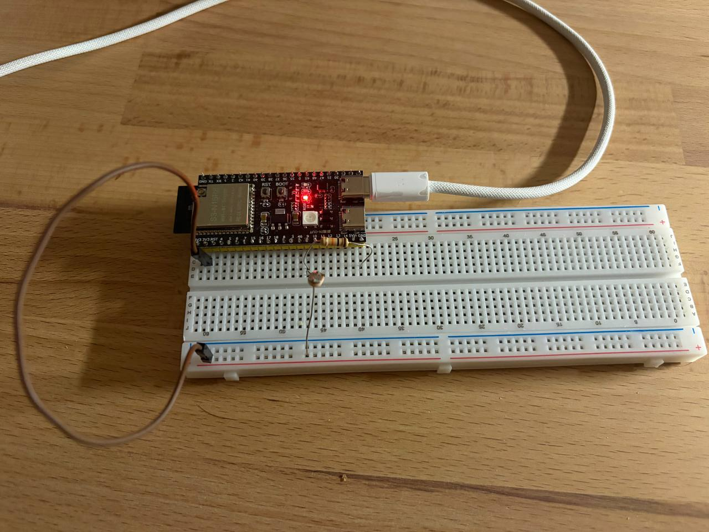

# Homework 1.6 - ADC calibration with an LDR

The voltage is measured across the resistor in series with an LDR (resistive divider).

The voltage is measured with `analogRead()` (non-calibrated) and `analogReadMilliVolts()`
(calibrated). The error of the non-calibrated method is estimated at different light levels.

## Setup



## Results

Typical "bright" values:

```
raw=3879  naive=2936 mV  cal=3064 mV  err= +4.18 %
raw=3881  naive=2937 mV  cal=3064 mV  err= +4.14 %
raw=3881  naive=2937 mV  cal=3064 mV  err= +4.14 %
raw=3885  naive=2941 mV  cal=3067 mV  err= +4.11 %
raw=3887  naive=2942 mV  cal=3067 mV  err= +4.08 %
```

Average lighting values:

```
raw=2099  naive=1588 mV  cal=1772 mV  err=+10.38 %
raw=2096  naive=1586 mV  cal=1770 mV  err=+10.40 %
raw=2095  naive=1585 mV  cal=1769 mV  err=+10.40 %
raw=2093  naive=1584 mV  cal=1770 mV  err=+10.51 %
raw=2091  naive=1582 mV  cal=1766 mV  err=+10.42 %
```

Typical "dark" values:

```
raw= 269  naive= 203 mV  cal= 234 mV  err=+13.25 %
raw= 270  naive= 204 mV  cal= 232 mV  err=+12.07 %
raw= 271  naive= 205 mV  cal= 232 mV  err=+11.64 %
raw= 269  naive= 203 mV  cal= 233 mV  err=+12.88 %
raw= 269  naive= 203 mV  cal= 234 mV  err=+13.25 %
```

## Conclusions

The relative error is higher in the dark (i.e. at lower measured voltages), but it is
significant at all voltages.
