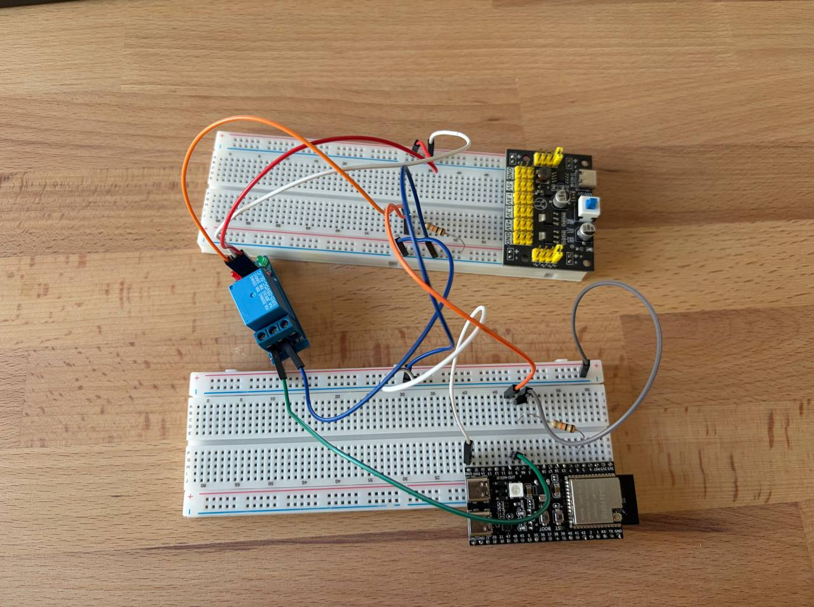

# Homework 2.2

Measuring the switching delay of a relay.

GPIO 5 (`CONTROL_PIN`) drives the transistor that energises the relay coil, and
GPIO 9 (`SENSE_PIN`) reads the relay contact back with an internal pull-up. A
relay does not close instantly: the armature needs a few milliseconds to pull
in, and the contact then bounces for a while before it stays closed.

An interrupt on the sense pin counts falling edges, so the main loop can
timestamp both the *first* edge (the contact touching for the first time) and
the *last* one (the contact finally settling). The first gives the pull-in
time, and the gap between the two gives the bounce duration.

Pins and timings live in [`src/config.h`](src/config.h).

## Setup



## Output

```
Sample 1
First edge detected at: 3792 us after switching on the transistor
Last edge detected at: 4412 us after switching on the transistor
Sample 2
First edge detected at: 3792 us after switching on the transistor
Last edge detected at: 4389 us after switching on the transistor
Sample 3
First edge detected at: 3793 us after switching on the transistor
Last edge detected at: 4391 us after switching on the transistor
Sample 4
First edge detected at: 3792 us after switching on the transistor
Last edge detected at: 4413 us after switching on the transistor
Sample 5
First edge detected at: 3794 us after switching on the transistor
Last edge detected at: 4415 us after switching on the transistor
Sample 6
First edge detected at: 3793 us after switching on the transistor
Last edge detected at: 4415 us after switching on the transistor
Sample 7
First edge detected at: 3794 us after switching on the transistor
Last edge detected at: 4413 us after switching on the transistor
Sample 8
First edge detected at: 3795 us after switching on the transistor
Last edge detected at: 4392 us after switching on the transistor
Sample 9
First edge detected at: 3794 us after switching on the transistor
Last edge detected at: 4415 us after switching on the transistor
Sample 10
First edge detected at: 3795 us after switching on the transistor
Last edge detected at: 4393 us after switching on the transistor
Mean sense time: 4404.80 us
Mean first edge time: 3793.40 us
```

The contact first touches ~3793 us after the coil is energised and settles
~4405 us after it, so the pull-in time is ~3.79 ms and the contact bounces for
a further ~611 us on top of that.

The first edge is extremely repeatable (3792–3795 us, ±2 us) — the mechanical
pull-in is a deterministic property of the relay. The last edge scatters more
(4389–4415 us) and falls into two clusters ~22 us apart, which is the contact
bouncing one extra time or one time fewer from sample to sample.
