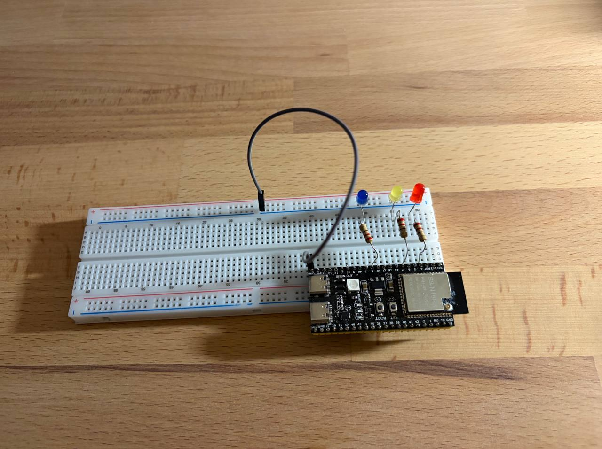

# Homework 2.3

3 LEDs bliniking using non-blocking code (polling in superloop, no delays).

* v1: implemenation with Arduino framework
* v2: implementation with ESP-IDF framework

## Setup

## Demo

https://github.com/user-attachments/assets/f7d7ee73-f23d-4d62-8865-84978eefe2c4

