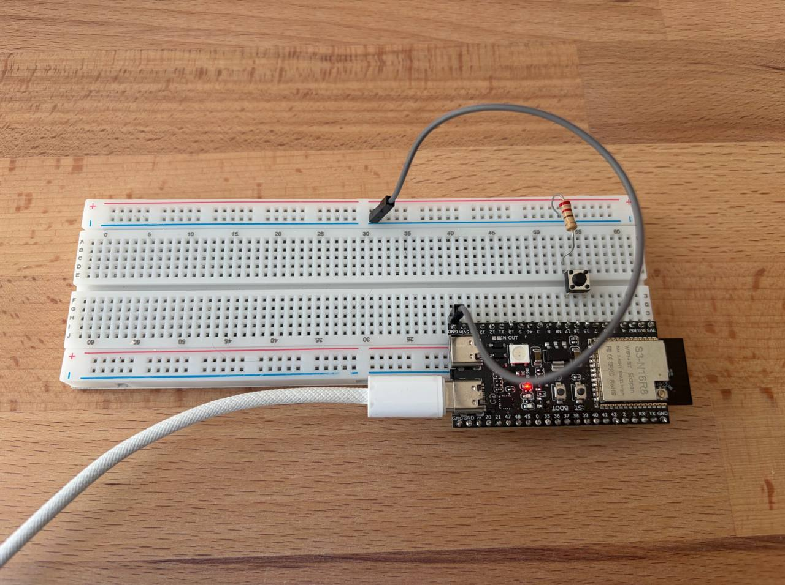

# Handling of the button presses with and without interrupts

* Mode 1: interrupt, no debounce
* Mode 2: interrupt, with debounce
* Mode 3: interrupt, with debounce, using the flag in the interruot
* Mode 4: same but non-blocking code 
* Mode 5: without interrupts

## Results:
* Mode 1: bounce every 3-4 presses
* Mode 2: still the same amount of bounces, because most of them were on release.
* Mode 3: very rare bounce (once in ~50 presses)
* Mode 4: same as mode 3
* Mode 5: same as mode 3.

## Setup

## Conclusions: 

The button with debounce can be implemented with polling, without the need for interrupts. Makes sense to use interrupts only on "emergency" buttons.