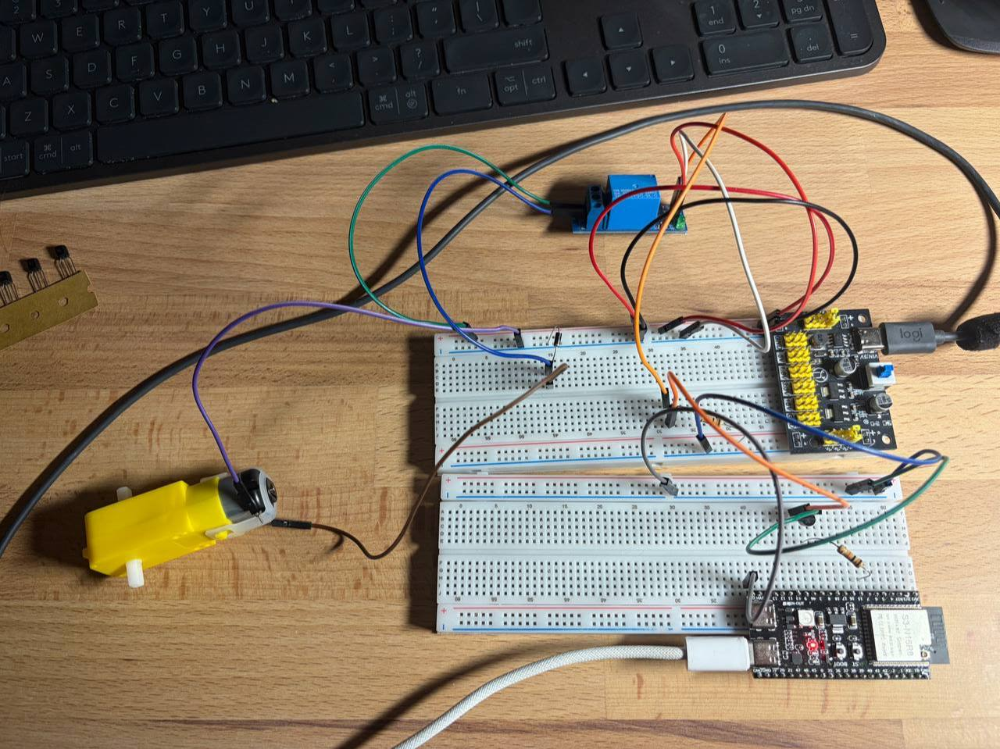

# Swithing on and off the motor with gp timer

The motor is controlled with peripheral gp timer, which switches the transistor every 3 seconds, which cotrnrols the relay. The motor is connected via relay with flyback diode for safety.

## Setup

## Demo

https://github.com/user-attachments/assets/fd8adbe7-8909-4c29-9123-59255ff20588

