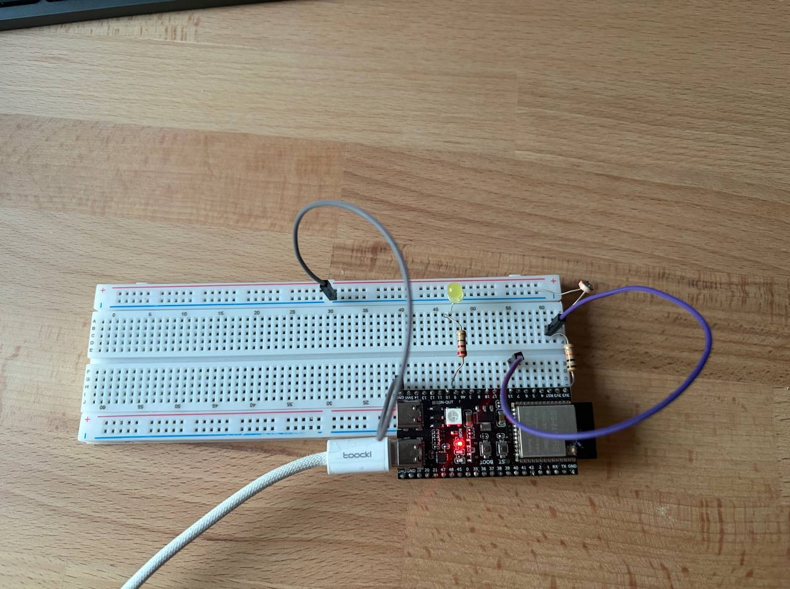

# HW3.1: SMA averaging on ADC

This project reads analog light sensor values from GPIO7 using the ESP32 ADC and applies a 16-sample simple moving average (SMA) filter to smooth the measurements. The averaged value is compared against hysteresis thresholds to control an LED, switching it on in dark conditions and off in bright conditions. The system logs both raw and filtered ADC values periodically to monitor the sensor's performance.

## Setup

## Demo

https://github.com/user-attachments/assets/0d69ad68-d796-43dd-956b-3e751812b02f

