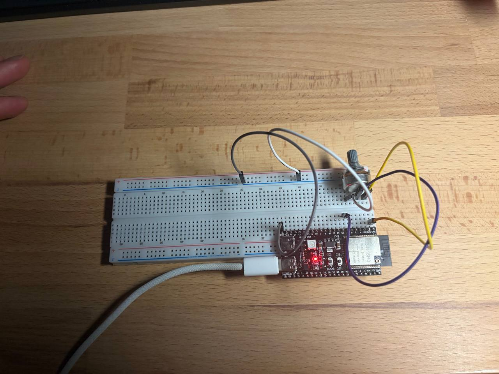
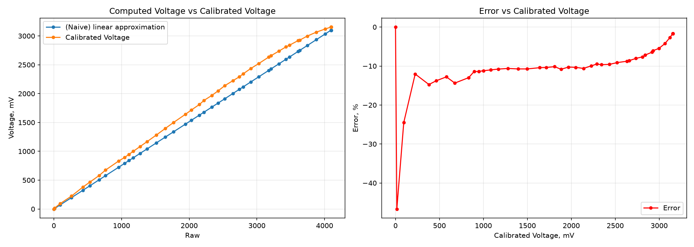

# HW3.2: SMA averaging on ADC

This project reads data using ACD from the middle pin of the potenciometer, and then prints the voltage computed with naive linear appriximation and with calibrated voltage reading fucntion of the ESP32 and compares the 2 on the whole range.

## Setup

## Results

The output of the log is saved to the [data.csv](data/data.csv)
Note: the data is reformated to csv.

The script at [scripts/analyze.py](scripts/analyze.py) plot the results:

