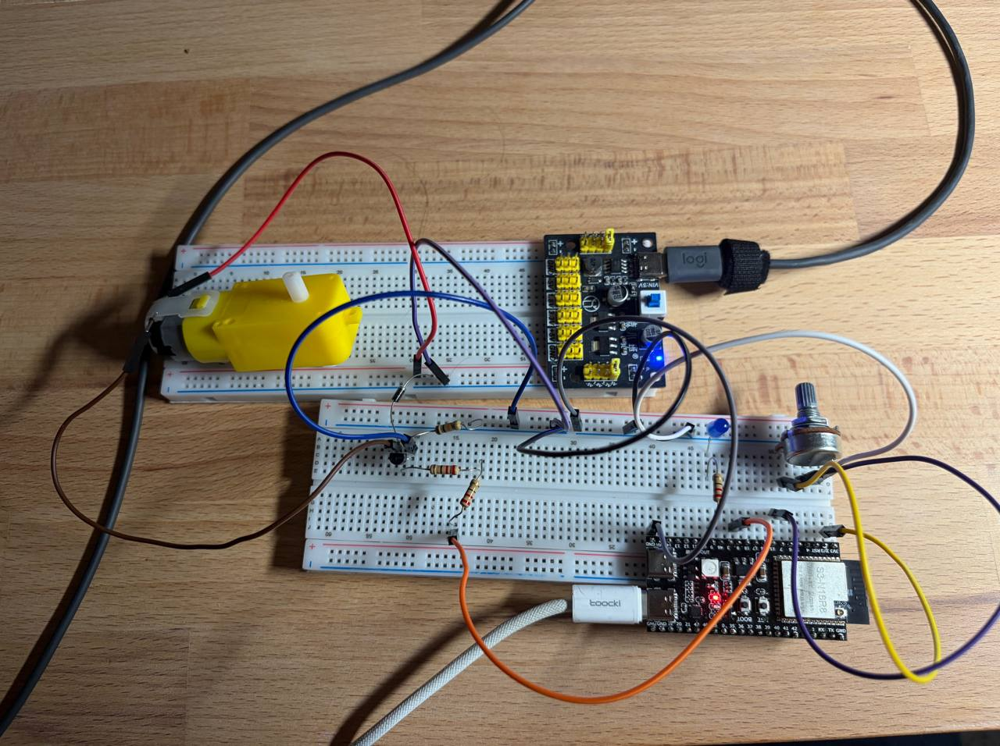

# HW3.3: Controlling the Motor and LED with PWM

This project demonstrates PWM (Pulse Width Modulation) control for both a DC motor and an LED on an ESP32 microcontroller.

## Features

- **PWM Control**: Configurable PWM signals for motor speed and LED brightness
- **Motor Driver**: DC motor control with adjustable speed
- **LED Control**: LED brightness control via PWM
- **ADC Input**: Analog input reading for sensor/potentiometer input

## Hardware Components

- ESP32 microcontroller
- DC motor with driver
- LED with current-limiting resistor
- Potentiometer (optional, for control input)

## Project Structure

```
main/
├── main.c          - Application entry point
├── pwm.c/h         - PWM driver implementation
├── motor.c/h       - Motor control functions
├── led.c/h         - LED control functions
└── adc.c/h         - ADC input reading
```

## Setup



## Demo


https://github.com/user-attachments/assets/f1318ab4-1828-401c-8268-4ce1e7e049da


