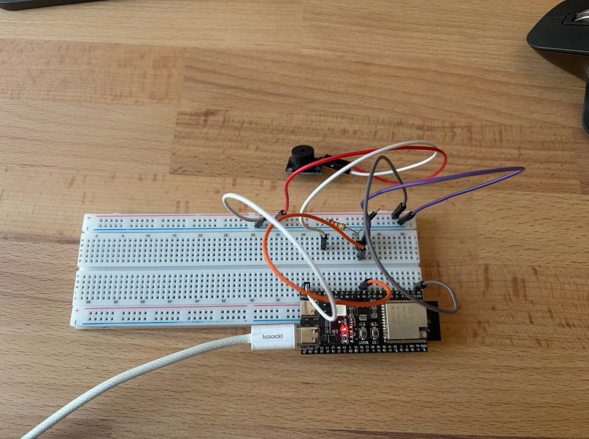

# HW3.4: Playing a short song with non-blocking code

This project plays a short clip from Super Mario Bros. theme on a passive buzzer driven by one
LEDC PWM channel. The melody is stored as a table of `{frequency, duration}`
notes, and playback runs without a single blocking delay.

## How it works

A periodic `esp_timer` fires every 25 ms (`TICK_MS`) and calls `player_tick()`,
which drives a small state machine:

| State      | Meaning                                              |
| ---------- | ---------------------------------------------------- |
| `ST_NOTE`  | a tone is sounding (or a rest is being waited out)    |
| `ST_GAP`   | 25 ms of silence so repeated notes stay distinct      |
| `ST_PAUSE` | 2 s of silence at the end of the song, then it loops  |

Each state is armed with a tick count; every tick just decrements a counter and
returns, so the callback never waits. When the counter reaches zero the machine
transitions: a finished note pays back its gap, and everything else pulls the
next note from the table.

The gap is subtracted from the note's own duration, so tempo stays exact. Tones
are produced by retuning the shared LEDC timer to the note's frequency at 50 %
duty, which gives the loudest square wave on a passive buzzer; rests simply set
the duty to 0.

## Setup

## Demo

https://github.com/user-attachments/assets/134f3282-0280-4ded-99b6-50d415da3b7d

