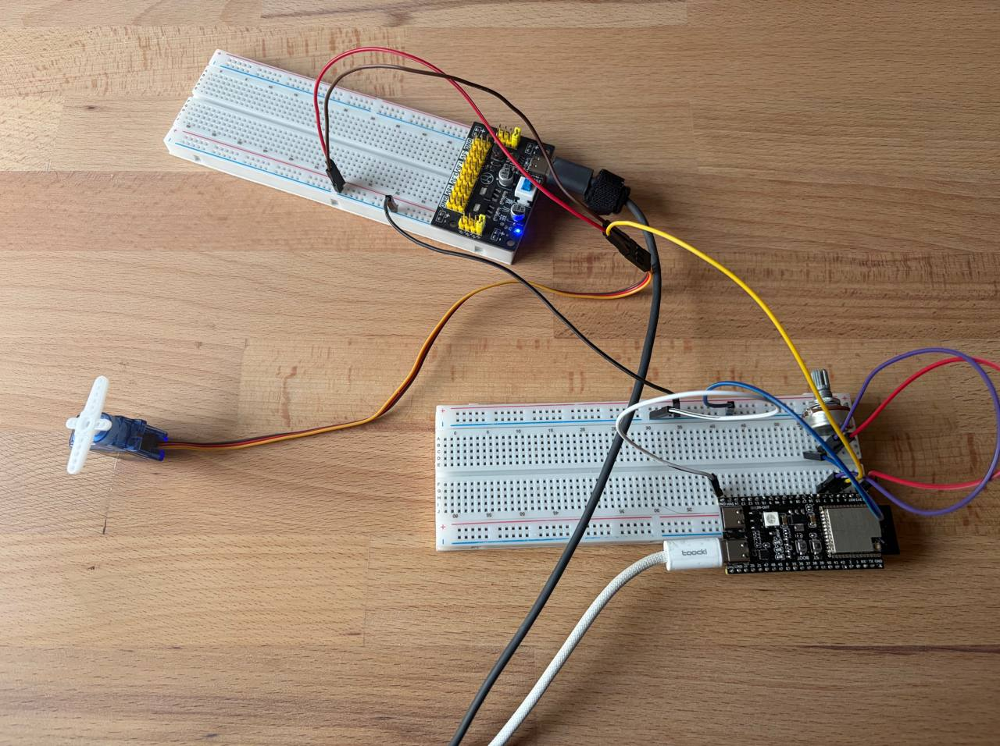

# HW3.5: Controlling the servo with potentiometer

The goal is to have the potentiometer to servo rotation 1:1. The potentiometer has a bit wider range, so only 180 degrees of it would count, others would be cut off.

## Calibration

First the reading from potentiometer has to be calibrated to angle. THis part is very UNaccutrate, but after few retries the average is somwhere at:

0 degress: 3450
180 degrees: 680

So readings above 3450 would be set to 0 angle, and readings below 680 would be set to 180 angle.

## Setup

## Demo

