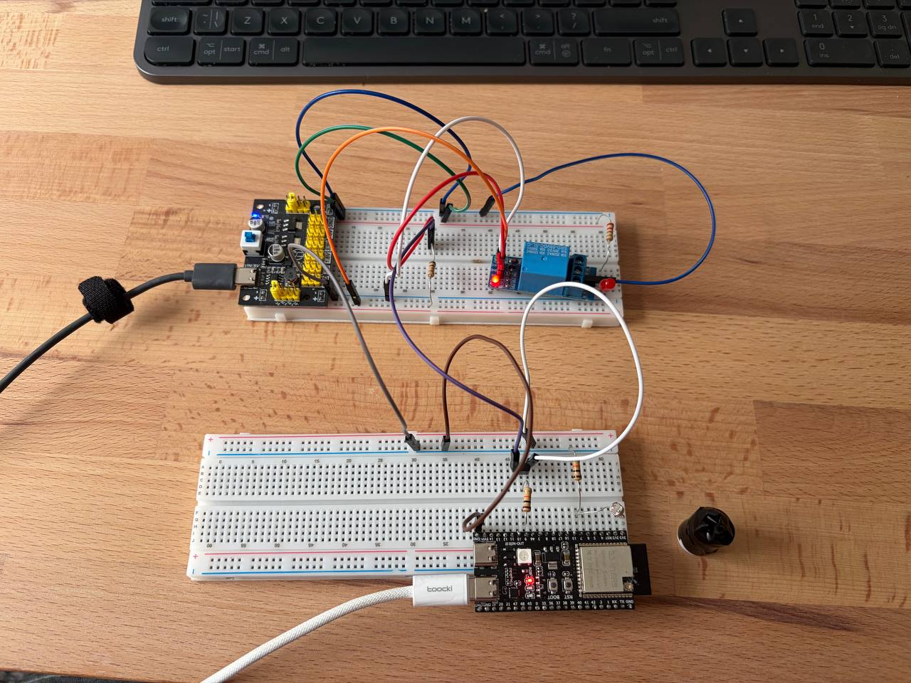

# Miniproject 1 - cotnrolling relay switch via the photoresistor and transistor.

## Setup

## Explanation

Photoresistor detects the level of lighting. The base of the transistor is controlled via the other output, which in turns swithces on and off the relay, which powers a diode.

Notes:
* the 5Vin on my ESP32 pin is not working (which could have powered the primary circuit of the relay), so the primary and secondary circuit of the relay is controlled from the same power board.

* the green diode on the relay is not working (the indicator of switching)

* **This variant drives the base with PWM** (`setVolts()` / `analogWrite()`) instead of a plain digital HIGH/LOW, so that different base voltages can be tested. Since the base is switched at the PWM frequency, the collector-emitter current is PWM as well, and so is the relay coil current. The relay chatters instead of holding a clean closed state - audibly noisy, and the repeated contact bouncing degrades the contacts over time. Bad idea for a relay; kept on this branch only as an experiment. Use the digital HIGH/LOW version on `main`, or add an RC filter on the base if a real analog voltage is needed.

## Demo