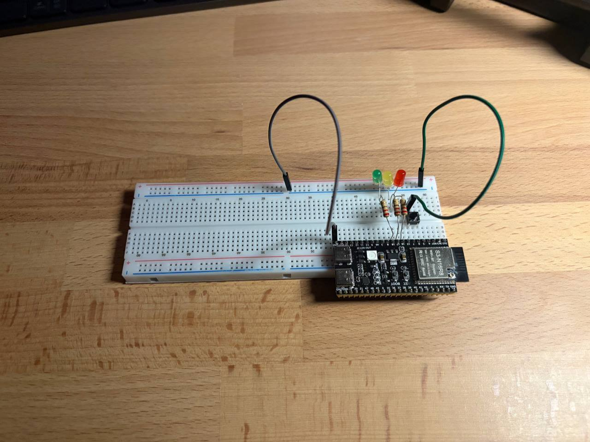

# Miniproject: traffic lights with state machine

The traffice lights has the following states (in order, in accordance with ukrainiang driving laws):

1. RED
2. RED_AND_YELLOW
3. GREEN
4. GREEN_BLINKING
5. YELLOW

The button controls them:
* short press switches the state to next
* long press resets to RED

## Imlementation

* The lamps_set() controls the pins connected to the leds.
* The blinking is implemented via callback task of esp32_timer, the timer resets on every lamps_set()
* the state of the traffic is saved in the FSM variable
* the state of the button is also saved in its own FSM variable
* the events registered on the button are changing the state of the traffic FSM

## Setup

## Demo

https://github.com/user-attachments/assets/622a2127-48d2-449f-9cac-2f877a5aa594
